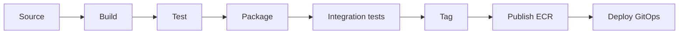

# modelmatch-frontend

> React SPA for **ModelMatch** — the recommender form, project + Jenkins setup, the savings dashboard,
> and the grounded chat panel. Part of the [ModelMatch portfolio build](../CLAUDE.md);
> full spec in [`../docs/planning/`](../docs/planning/).

## Table of Contents

- [Overview](#overview)
- [Architecture](#architecture)
- [Technology Stack](#technology-stack)
- [Repository Structure](#repository-structure)
- [Prerequisites](#prerequisites)
- [Getting Started](#getting-started)
- [CI/CD Pipeline](#cicd-pipeline)
- [Conventions](#conventions)
- [Release History](#release-history)
- [Contact](#contact)

## Overview

The browser-facing UI for ModelMatch — usable without a walkthrough.

Key features:

- **Recommender form** — task-type checkboxes, a quality↔cost slider, a latency toggle, and an optional
  free-text box that **keyword pre-fills** the form (the user confirms) → a pick result.
- **Project + Jenkins setup** — connect a Jenkins job with a BYOK key (stored server-side as refs) and
  copy the generated CI stage snippet.
- **Savings dashboard (centerpiece)** — KPI cards with sparklines, an actual-vs-baseline area chart
  (shaded gap = savings), cost/run bars colored by quality, token usage, a quality trend, and a runs
  table. Dark-mode default, monospace numbers.
- **Grounded chat panel (#4)** — opens with the auto "explain my spend" summary, then answers
  follow-ups with a **visible retrieval trace**; out-of-scope questions get an honest refusal.

## Architecture

The frontend is the presentation tier of a 3-tier app: it talks to the FastAPI backend over
**HTTPS/JSON only** and is served as static assets by **nginx** (never from the backend's `/static`).
The API base URL and other config come from the environment (templated `/config.js` / `import.meta.env`)
— nothing hardcoded. Authoritative spec:
[`../docs/planning/architecture.md`](../docs/planning/architecture.md) (§4.1 dashboard, §4.2 chat, §10
pages).

## Technology Stack

| Category             | Technologies   |
| -------------------- | -------------- |
| **Application**      | React 19 · TypeScript · Vite 6 |
| **Charts / UI**      | Recharts · Tailwind CSS (dark-mode default) |
| **Containerization** | Docker (multi-stage, non-root) · nginx (static serving) → ECR |
| **CI/CD**            | Jenkins — its own pipeline (8 stages); two-job CI (mock / live-gated) |
| **Testing**          | Vitest (unit) · Playwright (one happy-path e2e) |
| **Config**           | env-driven via templated `/config.js` / `import.meta.env` |

## Repository Structure

```
modelmatch-frontend/
├── src/
│   ├── pages/          # Login, Recommend form, Project, Jenkins setup, Savings dashboard, Chat
│   ├── components/     # shared UI components
│   ├── api/            # backend API client
│   ├── types/          # shared TypeScript types
│   └── main.tsx        # app entrypoint
├── public/             # static assets + templated config.js
├── index.html
├── Dockerfile          # multi-stage, non-root; nginx runtime
├── package.json
├── .env.example
└── CLAUDE.md
```

## Prerequisites

- Node.js 20+ and npm
- Docker (for the production image and CI integration tests)
- A `.env` copied from `.env.example` (never commit `.env`)

## Getting Started

> **Status: scaffolding (S1).** The Vite app, Tailwind/Recharts setup, and Dockerfile land with the
> S1 scaffold; the commands below are the intended workflow.

```bash
cp .env.example .env   # set VITE_API_BASE_URL etc.
npm install
npm run dev            # Vite dev server
npm run build          # production build (served by nginx in the image)
npm run test           # Vitest
```

Or bring up the whole stack (FE + BE + DB) from the repo root with `docker compose up`.

## CI/CD Pipeline

A dedicated Jenkins pipeline, independent of the backend's:
source → build → test (Vitest) → package (Docker) → integration tests (`main` & `feature/*`,
`docker compose up`) → tag → publish (ECR) → deploy (image-tag bump in the GitOps repo). Tag/publish/
deploy run on `main` only.



## Conventions

- API base URL + config from env; no hardcoded URLs or secrets.
- Branching: `feature/<story-id>-<desc>` → PR → `main` (protected). Conventional Commits; SemVer tags.

## Release History

- 0.0.1 — Initial scaffold (repo skeleton + stub entrypoint).

## Contact

Steve Levit — stevelevit230@gmail.com
