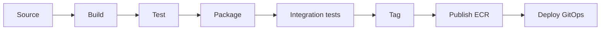

# modelmatch-frontend

> React SPA for **ModelMatch** — the recommender form, project + Jenkins setup, the savings dashboard,
> and the grounded chat panel. Part of the [ModelMatch portfolio build](../CLAUDE.md);
> full spec in [`../docs/planning/`](../docs/planning/).

## Table of Contents

- [Overview](#overview)
- [Architecture](#architecture)
- [Technology Stack](#technology-stack)
- [Repository Structure](#repository-structure)
- [Prerequisites](#prerequisites)
- [Getting Started](#getting-started)
- [CI/CD Pipeline](#cicd-pipeline)
- [Conventions](#conventions)
- [Release History](#release-history)
- [Contact](#contact)

## Overview

The browser-facing UI for ModelMatch — usable without a walkthrough.

Key features:

- **Recommender form** — the onboarding form scoped to the **`ci_review`** task (the proof path), shown
  as a fixed task pill with **budget** and **agent-speed (latency)** selectors → a pick result. The
  deterministic backend recommender also supports other task types + a keyword pre-fill endpoint; the FE
  doesn't surface those yet.
- **Project + Jenkins setup** — an onboarding wizard: pick → connect a Jenkins job by **base URL + job
  name only** (validated; no secrets sent — the agent reads the BYOK key + CI token from the user's own
  Jenkins credentials) → copy the generated CI stage snippet with its **one-time CI token**. Project
  creation is **deferred to commit** (abandoning leaves no orphan); existing projects can be **edited /
  re-picked**, **deleted**, and have their **CI token regenerated**.
- **Savings dashboard (centerpiece)** — KPI cards with sparklines, an actual-vs-baseline area chart
  (shaded gap = savings), cost/run bars colored by quality, token usage, a quality trend, and a runs
  table. Dark-mode default, monospace numbers.
- **Grounded chat panel (#4)** — opens with the auto "explain my spend" summary, then answers
  follow-ups with a **visible retrieval trace**; out-of-scope questions get an honest refusal.

## Architecture

The frontend is the presentation tier of a 3-tier app: it talks to the FastAPI backend over
**HTTPS/JSON only** and is served as static assets by **nginx** (never from the backend's `/static`).
The API base URL and other config come from the environment (templated `/config.js` / `import.meta.env`)
— nothing hardcoded. Authoritative spec:
[`../docs/planning/architecture.md`](../docs/planning/architecture.md) (§4.1 dashboard, §4.2 chat, §10
pages).

## Technology Stack

| Category             | Technologies   |
| -------------------- | -------------- |
| **Application**      | React 19 · TypeScript · Vite 6 |
| **Charts / UI**      | Recharts · Tailwind CSS (dark-mode default) |
| **Containerization** | Docker (multi-stage, non-root) · nginx (static serving) → ECR |
| **CI/CD**            | Jenkins — its own pipeline (8 stages); two-job CI (mock / live-gated) |
| **Testing**          | Vitest (unit) · Playwright happy-path e2e *(planned, S17)* |
| **Config**           | env-driven via templated `/config.js` / `import.meta.env` |

## Repository Structure

```
modelmatch-frontend/
├── src/
│   ├── pages/          # Login · Onboarding (recommender form → pick → project → Jenkins) · Dashboard
│   ├── components/     # dashboard widgets (KpiCard, SavingsAreaChart, RunsTable, QualityTrend, …),
│   │                   #   the ChatPanel + RetrievalTraceDetail, ProjectSwitcher, onboarding/
│   ├── api/            # backend API client
│   ├── lib/            # shared helpers
│   ├── types/          # shared TypeScript types
│   └── main.tsx        # app entrypoint
├── public/             # static assets + templated config.js
├── index.html
├── Dockerfile          # multi-stage, non-root; nginx runtime
├── package.json
├── .env.example
└── CLAUDE.md
```

## Prerequisites

- Node.js 20+ and npm
- Docker (for the production image and CI integration tests)
- A `.env` copied from `.env.example` (never commit `.env`)

## Getting Started

> **Status: built through S15d** (frontend **v0.5.0**) — login + auth gate, the savings dashboard +
> grounded chat panel (S15a), the recommender / project / Jenkins onboarding wizard (S15b/S15c), and
> **project lifecycle** (defer-create so abandoning leaves no orphan, Jenkins URL validation, edit /
> re-pick, delete, regenerate CI token) (S15d) are all in.

```bash
cp .env.example .env   # set VITE_API_BASE_URL (defaults to http://localhost:8000)
npm install
npm run dev            # Vite dev server on :5173
npm run build          # tsc + production build (served by nginx in the image)
npm run typecheck      # tsc --noEmit
npm run test           # Vitest
```

Point `VITE_API_BASE_URL` at a running backend (see the backend README / the
[runbook](../modelmatch-backend/docs/runbook.md) for `docker compose up`). In production the API base
URL is injected at runtime via a templated `/config.js` served by nginx — nothing is hardcoded.

**New here?** The cross-cutting [Runbook & Demo Walkthrough](../modelmatch-backend/docs/runbook.md)
covers the product story, the two-surface model rule, env reference, and an end-to-end demo script.

## CI/CD Pipeline

A dedicated Jenkins pipeline, independent of the backend's:
source → build → test (Vitest) → package (Docker) → integration tests (`main` & `feature/*`,
`docker compose up`) → tag → publish (ECR) → deploy (image-tag bump in the GitOps repo). Tag/publish/
deploy run on `main` only.



## Conventions

- API base URL + config from env; no hardcoded URLs or secrets.
- Branching: `feature/<story-id>-<desc>` → PR → `main` (protected). Conventional Commits; SemVer tags.

## Release History

SemVer tags on `main`. Current: **v0.5.0** (S15d project lifecycle — defer-create, URL validation,
edit/delete + CI-token regenerate). Earlier: v0.4.0 recommender / project / Jenkins onboarding (S15b/c) ·
v0.3.0 login + dashboard + chat (S15a) · v0.2.0 first savings dashboard (S14). Full log: `git tag`.

- 0.0.1 — Initial scaffold (repo skeleton + stub entrypoint).

## Contact

Steve Levit — stevelevit230@gmail.com
