# modelmatch-frontend

> React SPA for **ModelMatch** — the recommender form, the project + Jenkins onboarding wizard, the
> savings dashboard, and the grounded chat panel. Part of the
> [ModelMatch portfolio build](../CLAUDE.md); full spec in [`../docs/planning/`](../docs/planning/).

## Table of Contents

- [Overview](#overview)
- [Architecture](#architecture)
- [Technology Stack](#technology-stack)
- [Repository Structure](#repository-structure)
- [Prerequisites](#prerequisites)
- [Getting Started](#getting-started)
- [Configuration](#configuration)
- [CI/CD Pipeline](#cicd-pipeline)
- [Conventions](#conventions)
- [Release History](#release-history)
- [Contact](#contact)

## Overview

The browser-facing UI for ModelMatch — the product whose one-liner is *prove a cheaper LLM is good
enough for your CI, and show the money saved.* This repo is the **presentation tier only**; it talks to
the FastAPI backend over HTTPS/JSON and is served as static assets by nginx.

Key features:

- **Recommender form** — onboarding scoped to the **`ci_review`** task (the proof path), shown as a
  fixed task pill with **budget** and **agent-speed (latency)** selectors → a deterministic pick result.
  The backend recommender runs **no LLM** in the ranking; the form just collects inputs and renders the
  scored shortlist it returns.
- **Project + Jenkins setup wizard** — pick → connect a Jenkins job by **base URL + job name only**
  (validated; **no secrets sent** — the agent reads the user's BYOK key + CI token from the user's own
  Jenkins credentials) → copy the generated CI stage snippet with its **one-time CI token**. Project
  creation is **deferred to commit** (abandoning leaves no orphan); projects can be **edited / re-picked**,
  **deleted**, and have their **CI token regenerated**.
- **Savings dashboard (centerpiece)** — KPI cards with sparklines, an actual-vs-baseline area chart
  (shaded gap = savings, counted only when the quality gate holds), cost/run bars colored by quality,
  token usage, a quality trend, and a runs table. Dark-mode default, monospace numerals.
- **Grounded chat panel (#4)** — opens with the auto "explain my spend" summary, then answers follow-ups
  with a **visible retrieval trace**; out-of-scope questions get an honest refusal.

### Where it fits — the two-surface model rule

ModelMatch uses LLMs on **two separate surfaces**, and the FE touches neither directly — it only renders
what the backend returns:

| Surface | Models | Auth |
|---|---|---|
| **In-cluster backend** (ingestion + chat) | Bedrock **Nova Lite** only | **IRSA** (no static keys) |
| **CI agent** (the proof, in the user's Jenkins) | **BYOK** — any provider | the user's own key |

The CI snippet the wizard hands out defaults to **Anthropic Haiku** on the user's key. The FE never sees
provider keys. The demo also exercises a **Gemini free-tier** path — and because Gemini's free tier
**trains on inputs and allows human review**, it is fed **only non-confidential demo fixtures** (Anthropic
and Bedrock don't train on inputs). See the [runbook](../modelmatch-backend/docs/runbook.md) for the full
product story.

## Architecture

The frontend is the presentation tier of a 3-tier app (**React SPA → FastAPI → in-cluster PostgreSQL**).
It talks to the backend over **HTTPS/JSON only** and is served as static assets by **nginx**
(nginx-unprivileged, never from the backend's `/static`). The API base URL and other config come from the
**environment** — `VITE_*` vars at dev time, a templated `/config.js` injected at container start in
production — so **nothing is hardcoded**. Authoritative spec:
[`../docs/planning/architecture.md`](../docs/planning/architecture.md) (§4.1 dashboard, §4.2 chat, §10
pages).

In the cluster the SPA is reachable at the public ingress host **`app.<ip>.sslip.io`** and calls the
backend at **`api.<ip>.sslip.io`** — both derive from the single ingress ELB IP (see the
[gitops repo](../modelmatch-gitops/README.md#ingress-host-recompute-p15-runbook)).

## Technology Stack

| Category             | Technologies   |
| -------------------- | -------------- |
| **Application**      | React 19 · TypeScript · Vite 6 |
| **Charts / UI**      | Recharts · Tailwind CSS (dark-mode default) |
| **Containerization** | Docker (multi-stage, non-root) · nginx-unprivileged (uid 101, port 8080) → ECR |
| **CI/CD**            | Jenkins multibranch pipeline (`Jenkinsfile`, P17) — build · 3 test types · Trivy · release tail |
| **Testing**          | Vitest (unit/component + RTL+MSW contract) · Container Integration (FE image boundary smoke) · Playwright (E2E) |
| **Config**           | env-driven: `VITE_*` (dev) / templated `/config.js` injected by nginx (prod) |

## Repository Structure

```
modelmatch-frontend/
├── src/
│   ├── pages/          # Login · Onboarding (form → pick → project → Jenkins) · Dashboard
│   ├── components/     # dashboard widgets (KpiCard, SavingsAreaChart, RunsTable, QualityTrend, …),
│   │                   #   the ChatPanel + RetrievalTraceDetail, ProjectSwitcher, onboarding/
│   ├── api/            # backend API client
│   ├── lib/            # shared helpers
│   ├── types/          # shared TypeScript types
│   └── main.tsx        # app entrypoint
├── public/             # static assets
├── docker-entrypoint.d/# injects /config.js (API_BASE_URL) into the nginx image at start
├── nginx.conf          # nginx-unprivileged server config
├── e2e/                # Playwright specs (happy-path hermetic + real-stack smoke)
├── ci/                 # CI helpers (pipeline.env, e2e-stack.sh, free-ports.sh, e2e/)
├── Dockerfile          # multi-stage, non-root; nginx-unprivileged runtime
├── package.json
├── .env.example
├── Jenkinsfile         # P17 CI/CD pipeline
└── CLAUDE.md
```

## Prerequisites

- Node.js 20+ and npm
- Docker (for the production image and the compose-based E2E)
- A `.env` copied from `.env.example` (never commit `.env`)

## Getting Started

> **Status: application feature-complete (v1.0.x).** Login + auth gate, the savings dashboard + grounded
> chat panel, the recommender / project / Jenkins onboarding wizard, and full project lifecycle
> (defer-create, URL validation, edit / re-pick / delete / CI-token regenerate) are all in. The
> deployed image is wired into the cluster via the [gitops](../modelmatch-gitops/README.md) umbrella.

```bash
cp .env.example .env   # set VITE_API_BASE_URL (defaults to http://localhost:8000)
npm ci
npm run dev            # Vite dev server on :5173
npm run build          # tsc && vite build (output served by nginx in the image)
npm run lint           # ESLint
npm run typecheck      # tsc --noEmit
npm test               # Vitest (unit/component) — fast contract checks
npm run test:integration   # Vitest + RTL + MSW (UI/client contract, no containers)
# Container Integration (P31) lives in CI only: the freshly-built FE image runs behind
# nginx against a pinned backend dependency from ci/pipeline.env. Two thin sub-smokes:
#   (a) ci/integration-smoke.sh — curl/python: nginx serves the SPA, /config.js embeds
#       API_BASE_URL, CORS preflight + a real cross-origin round-trip.
#   (b) e2e/container-integration.browser.spec.ts (playwright.config.container-integration.ts)
#       — ONE Playwright spec: loads /, asserts window.__APP_CONFIG__.apiBaseUrl, and
#       fetches /readyz from page context. NOT the happy path (that's E2E).
npm run e2e            # Playwright happy-path (hermetic; auto-starts the dev server)
```

Point `VITE_API_BASE_URL` at a running backend (see the backend README /
[runbook](../modelmatch-backend/docs/runbook.md) for `docker compose up`). In production the API base URL
is injected **at container start** via a templated `/config.js` served by nginx — nothing is hardcoded.

### End-to-end tests (Playwright)

Specs live in `e2e/`; configs are `playwright.config.ts` (happy-path) and `playwright.config.e2e.ts`
(compose-stack E2E run by CI). First time: `npx playwright install chromium`.

```bash
npm run e2e          # happy-path only (CI-able, backend fully mocked via page.route)
npm run e2e:headed   # same, with a visible browser
npm run e2e:all      # also runs the optional real-stack smoke
```

- **happy-path** (`e2e/happy-path.spec.ts`) — drives the real SPA login → home hub → *Create a new
  CI-Agent* → recommend (ci_review) → pick → defer-create at the Jenkins step → CI-setup token → dashboard
  → grounded chat, with a **mocked CI run** seeding the panels. Hermetic + deterministic (no DB, no LLM).
- **real-stack** (`e2e/real-stack.smoke.spec.ts`) — the same flow against a **real backend** on `:8000`,
  exercising the genuine `POST /ci-runs` ingest with a real per-project token. **Self-skips** when the
  backend is unreachable. Both cost **$0**.

### Containerized stack (`docker-compose.yaml`)

`docker-compose.yaml` brings the **whole app** up from images — `db` (postgres:16) → a one-off
**`migrate`** step (the backend image running `alembic upgrade head` + catalog seed) → `backend`
(gunicorn) → `frontend` (this image's nginx, with `config.js` injected at start from `API_BASE_URL`). Used
for local integration runs.

```bash
docker build -t modelmatch-frontend:latest .
docker build -t modelmatch-backend:latest ../modelmatch-backend
JWT_SECRET=$(openssl rand -hex 32) docker compose up -d   # FE :8080 · BE :8000 · db
```

**New here?** The cross-cutting [Runbook & Demo Walkthrough](../modelmatch-backend/docs/runbook.md)
covers the product story, the two-surface model rule, env reference, and an end-to-end demo script.

## Configuration

All config is read from the environment — **no hardcoded URLs or secrets**.

| Variable | Where | Purpose |
|---|---|---|
| `VITE_API_BASE_URL` | dev (`.env`) | backend base URL Vite bakes in for `npm run dev` / local builds |
| `API_BASE_URL` | prod (container env) | injected into `/config.js` at nginx start; the **browser-facing** public host (`api.<ip>.sslip.io`), not the in-cluster Service DNS — the user's browser, not nginx, calls the backend |

## CI/CD Pipeline

A dedicated Jenkins **multibranch** pipeline ([`Jenkinsfile`](Jenkinsfile), P17), independent of the
backend's. Every branch runs the full validation flow; only `main` runs the release tail. No static AWS
keys — the controller uses its EC2 instance role for ECR, and SSH deploy keys (referenced by credential
ID) to push the tag and the gitops bump. Toolchains (Node, Playwright, Trivy, yq) run as pinned throwaway
containers.

```mermaid
graph LR
    A[Source + config] --> B[Build npm ci/build]
    B --> C[Static/dep gate<br/>eslint · tsc · npm audit]
    C --> D[Test<br/>Vitest unit/component]
    D --> E[Package<br/>FE image]
    E --> F[Trivy scan<br/>CRITICAL+HIGH]
    F --> G[FE contract tests<br/>Vitest+RTL+MSW]
    G --> H[Container Integration<br/>FE image · boundary smoke]
    H --> I[E2E<br/>throwaway compose]
    I --> J[Tag · main]
    J --> K[Publish ECR · main]
    K --> L[Deploy<br/>gitops bump · main]
```



The **Deploy** stage bumps `frontend.image.tag` in the [gitops](../modelmatch-gitops) umbrella values;
**ArgoCD** syncs it — this repo never `kubectl apply`s.

## Conventions

- API base URL + config from env; no hardcoded URLs or secrets.
- Branching: `feature/<story-id>-<desc>` → PR (self-review) → `main`. Conventional Commits; SemVer tags
  on `main`.

## Release History

SemVer tags on `main`, one per merged slice. **v1.0.0** marked the app feature-complete; the **v1.0.x**
patch line carries DevOps-delivery refinements (the deployed image is currently `1.0.4`). Earlier:
v0.7.0 register/logout UI · v0.5.0 project lifecycle · v0.4.0 recommender/project/Jenkins onboarding ·
v0.3.0 login + dashboard + chat · v0.2.0 first savings dashboard. Full log: `git tag`.

- 0.0.1 — Initial scaffold (repo skeleton + stub entrypoint).

## Contact

Steve Levit — stevelevit230@gmail.com
</content>
</invoke>
